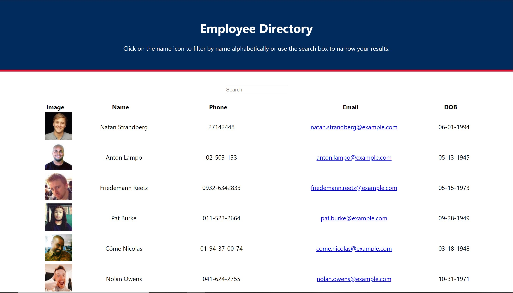

# reactEmployee

## Table of Contents

[Description](#Description)

[Installation](#Installation)

[Usage](#Usage)

[Licenses](#Licenses)

[Contributors](#Contributors)

[Tests](#Tests)

[Questions](#Questions)

[Links](#Links)

[Screenshots](#Screenshots)

## Description

For this assignment, we were tasked with creating an Employee Directory with React.

As a user, I want to be able to view my entire employee directory at once so that I have quick access to their information.

An employee or manager would benefit greatly from being able to view non-sensitive data about other employees. It would be particularly helpful to be able to filter employees by name.

## Installation

N/A

## Usage

N/A

## Licenses

N/A

## Contributors

- Matt Rikard

## Tests

N/A

## Questions

You may reach me at matthew.rikard@gmail.com for further questions.

## Links

https://fathomless-cliffs-09990.herokuapp.com/

## Screenshots

